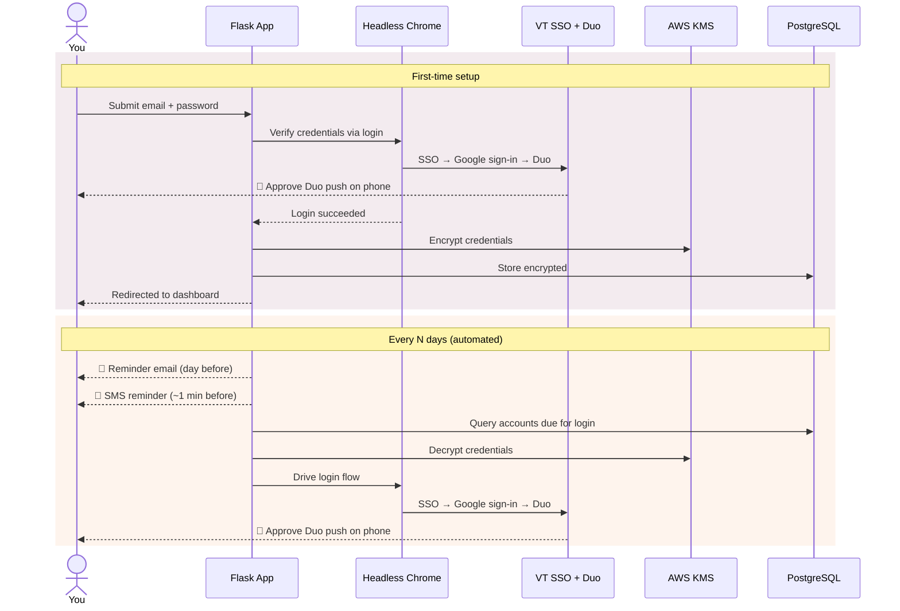
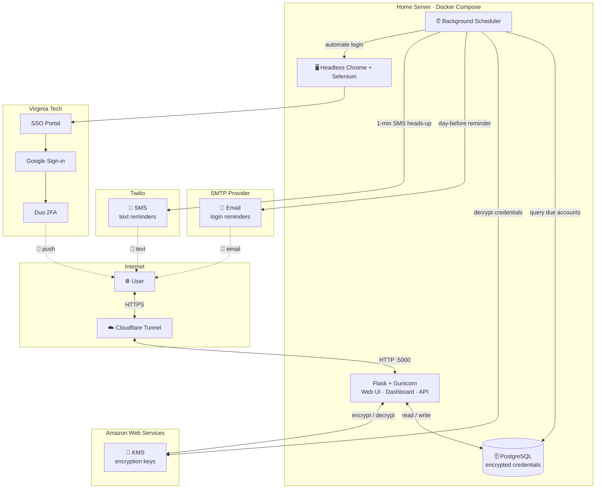

# Virginia Tech Email Saver

<p align="center">
  
  
  
  
  
  
  
  
</p>

Keep your Virginia Tech Gmail account active with automated logins. This Flask-based web app securely stores your credentials, automates the entire VT SSO + Duo 2FA login flow, and lets you control how often it runs.

**Live at [vtemailsaver.tfeuerbach.dev](https://vtemailsaver.tfeuerbach.dev)** — or self-host it yourself if you'd rather not trust a third party with your credentials. Everything you need is in this repo.

## Architecture



<details>
<summary><strong>System architecture (click to expand)</strong></summary>



</details>

## Features

- **Automated Gmail Logins** — Selenium drives a headless Chrome instance through VT's SSO portal, Google sign-in, and Duo 2FA prompts.
- **Configurable Login Cadence** — Set how often the app logs in on your behalf (1–90 days, defaults to 25) via a dashboard slider.
- **Preferred Login Time** — Pick your preferred hour and timezone for scheduled logins. Timezone is auto-detected from your browser and can be overridden from the dashboard.
- **Background Scheduler** — A daemon thread runs hourly clock-aligned checks, firing overdue logins immediately and scheduling upcoming ones with precise timers.
- **Login Reminders** — Optional email notification the day before each login, toggleable on/off from the dashboard. Also includes a downloadable recurring `.ics` calendar event (Apple Calendar, Google Calendar, Outlook).
- **SMS Notifications** — Opt-in text message reminders via Twilio, sent ~1 minute before each scheduled login so you're ready for the Duo push.
- **Custom Notification Email** — Use a different email address for login reminders instead of your VT email.
- **Account Removal** — Remove your account and all stored data with a swipe-to-confirm gesture. Log in again any time to re-register.
- **Privacy Policy** — In-app privacy policy covering data handling, third-party services, and opt-out instructions.
- **Dashboard** — View your last login, next scheduled login, scheduler status, and adjust all settings in one place.
- **Modern UI** — Glassmorphism cards, gradient background, Rubik font, Lottie animations, and responsive layout.
- **Production-Ready** — Gunicorn, PostgreSQL, Docker Compose, and Cloudflare Tunnel support.

## Security

Your credentials are **never stored in plaintext**. The source code is fully open — you can audit every line.

1. **AWS KMS encryption** — Credentials are encrypted with [AWS KMS](https://aws.amazon.com/kms/) before touching the database. The encryption key lives in AWS, not on the server.
2. **Session-based auth** — The dashboard is protected by server-side sessions. No user-facing URLs leak account information.
3. **CSRF protection** — Every POST endpoint is guarded by Flask-WTF CSRF tokens.
4. **Endpoint lockdown** — All sensitive endpoints require an authenticated session. Unauthenticated requests are rejected or redirected.
5. **Secure cookies** — HTTP-only, SameSite-restricted. HTTPS-only in production.
6. **No credential logging** — Passwords are never written to logs. The app uses structured Python `logging` throughout.

## Tech Stack

| Layer | Technology |
|-------|-----------|
| Backend | Flask, Gunicorn, SQLAlchemy |
| Database | PostgreSQL or SQLite |
| Encryption | AWS KMS via `boto3` |
| Notifications | SMTP (email), Twilio (SMS), iCalendar (.ics) |
| Browser Automation | Selenium + headless Chrome |
| Frontend | HTML/CSS/JS, Bootstrap Icons, Lottie animations |
| Infrastructure | Docker Compose, Cloudflare Tunnel |

## Self-Hosting

Don't want to hand your credentials to a hosted service? Totally fair — that's why this repo exists. You can run the entire app yourself with a minimal setup and host it for yourself or your friends. **No email service, no SMS provider, no Cloudflare account needed.**

### What you need

| Requirement | Why |
|---|---|
| AWS account with a KMS key | Encrypts your credentials at rest ([free tier](https://aws.amazon.com/kms/pricing/) covers 20,000 requests/month) |
| Docker **or** Python 3.11+ & Google Chrome | Runs the app (Docker is easiest — it bundles Chrome for you) |

That's it. Everything else — email reminders, SMS notifications, Cloudflare Tunnel, PostgreSQL — is completely optional. The app detects which services are configured and disables the rest gracefully.

### 1. Clone and configure

```bash
git clone https://github.com/tfeuerbach/virginiatech-email-saver.git
cd virginiatech-email-saver
cp .env.example .env
```

Open `.env` and fill in your AWS KMS credentials and a `SECRET_KEY`. You can ignore every other variable:

```env
FLASK_ENV=development
SECRET_KEY=any-random-string-here

AWS_ACCESS_KEY_ID=your-key
AWS_SECRET_ACCESS_KEY=your-secret
AWS_REGION=us-east-1
KMS_KEY_ID=your-kms-key-id
```

### 2. Run the app

#### Option A: Docker Compose (recommended)

The container bundles Python, Chrome, ChromeDriver, and all dependencies — nothing else to install.

```bash
docker compose up --build -d
```

The app starts on `http://localhost:5000` with PostgreSQL and Gunicorn. To bring it down: `docker compose down`. Your data persists in a Docker volume.

#### Option B: Run locally without Docker

If you'd rather skip Docker, you'll need Python 3.11+ and Google Chrome installed on your machine.

```bash
python3.11 -m venv .venv
source .venv/bin/activate
pip install -r requirements.txt
flask --app web run
```

No `DATABASE_URL` needed — the app defaults to a local SQLite file (`instance/encrypted_credentials.db`), created automatically on first run.

Either way, open `http://localhost:5000`, add your VT account, and you're done.

### 3. Track your logins

The dashboard has a **Download Calendar** button that gives you a recurring `.ics` file. Import it into Apple Calendar, Google Calendar, Outlook, or any iCalendar-compatible app and you'll get reminders before each scheduled login with built-in alerts at 1 hour and 15 minutes before — no email or SMS service required.

When a login runs, just approve the Duo push on your phone.

### Optional: Email notifications

If you want email reminders the day before each login (plus a welcome email when you first add your account), add SMTP credentials to your `.env`. Works with any SMTP provider — AWS SES, Gmail app passwords, SendGrid, Mailgun, etc.:

```env
SMTP_HOST=email-smtp.us-east-1.amazonaws.com
SMTP_PORT=587
SMTP_USER=your-smtp-username
SMTP_PASSWORD=your-smtp-password
SMTP_FROM_EMAIL=noreply@yourdomain.com
SMTP_FROM_NAME=VT Email Saver
SMTP_USE_TLS=true
```

If `SMTP_HOST` is blank or missing, the app skips all email features. The dashboard will show email notifications as "Off" until configured.

### Optional: SMS notifications

For text message reminders ~1 minute before each login, add Twilio credentials:

```env
TWILIO_ACCOUNT_SID=your-account-sid
TWILIO_AUTH_TOKEN=your-auth-token
TWILIO_FROM_NUMBER=+1XXXXXXXXXX
```

Same deal — leave these blank and SMS is simply disabled.

## Contributing

Contributions are welcome! Here's how to set up a development environment.

### Dev environment setup

The app supports both **SQLite** (zero config) and **PostgreSQL** (production-like). For contributing, either works.

#### Local development (SQLite)

```bash
git clone https://github.com/tfeuerbach/virginiatech-email-saver.git
cd virginiatech-email-saver
cp .env.example .env          # fill in AWS KMS creds + SECRET_KEY
python3.11 -m venv .venv
source .venv/bin/activate
pip install -r requirements.txt
flask --app web run
```

#### Docker Compose (PostgreSQL + Gunicorn)

```bash
docker compose up --build -d
```

Set `DATABASE_URL` in your `.env` to use Postgres:

```env
FLASK_ENV=production
DATABASE_URL=postgresql://postgres:yourpassword@db:5432/encrypted_credentials
```

See [DEPLOY.md](DEPLOY.md) for full production deployment instructions including Cloudflare Tunnel setup.

### Development vs. Production

| | Development | Production |
|---|---|---|
| **Database** | SQLite (default) or Postgres | PostgreSQL |
| **Server** | Flask dev server (debug + auto-reload) | Gunicorn (1 worker, 4 threads) |
| **HTTPS** | Not required (cookies work over HTTP) | Required (secure cookies, Cloudflare Tunnel) |
| **Config** | `FLASK_ENV=development` | `FLASK_ENV=production` |

### Testing

```bash
# Inside Docker (recommended — has all dependencies):
docker compose exec web python -m pytest tests/ -v

# Or locally with a virtual environment:
.venv/bin/pytest tests/ -v
```

112 tests across 8 test files covering models, routes (dashboard, form, schedule), CSRF protection, KMS encryption, scheduler logic, phone normalization, and database integration. Runs in ~1 second using in-memory SQLite — no external services needed.

### Linting

The project uses [Ruff](https://docs.astral.sh/ruff/) for linting and formatting. Configuration lives in `pyproject.toml`.

```bash
ruff check .          # lint
ruff check --fix .    # lint + auto-fix
ruff format .         # format
ruff format --check . # check formatting without changes
```

### Pre-commit Hook

A git pre-commit hook runs `ruff check` and `ruff format --check` before every commit. It's installed at `.git/hooks/pre-commit` and uses `.venv/bin/ruff` if available.

### CI

A GitHub Actions workflow (`.github/workflows/ci.yml`) runs both lint and test on every push and pull request to `main`/`master`. The test job only runs if linting passes.

### Planned Improvements

- **Alembic migrations** — Replace the current `add_column_if_missing` approach with [Alembic](https://alembic.sqlalchemy.org/) for versioned, reversible schema migrations.
- **Mock AWS in tests** — Add mocked KMS tests (via `unittest.mock`) so encrypt/decrypt logic is covered in CI without real AWS credentials. The current KMS tests are skipped in CI and only run locally with valid credentials.

Feel free to fork the repository, submit pull requests, or suggest improvements.

## License

This project is licensed under the MIT License. See the `LICENSE` file for details.
