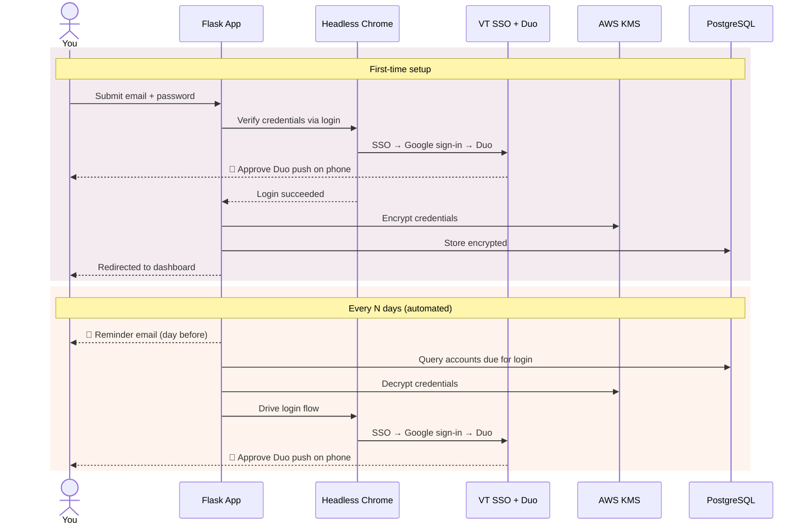
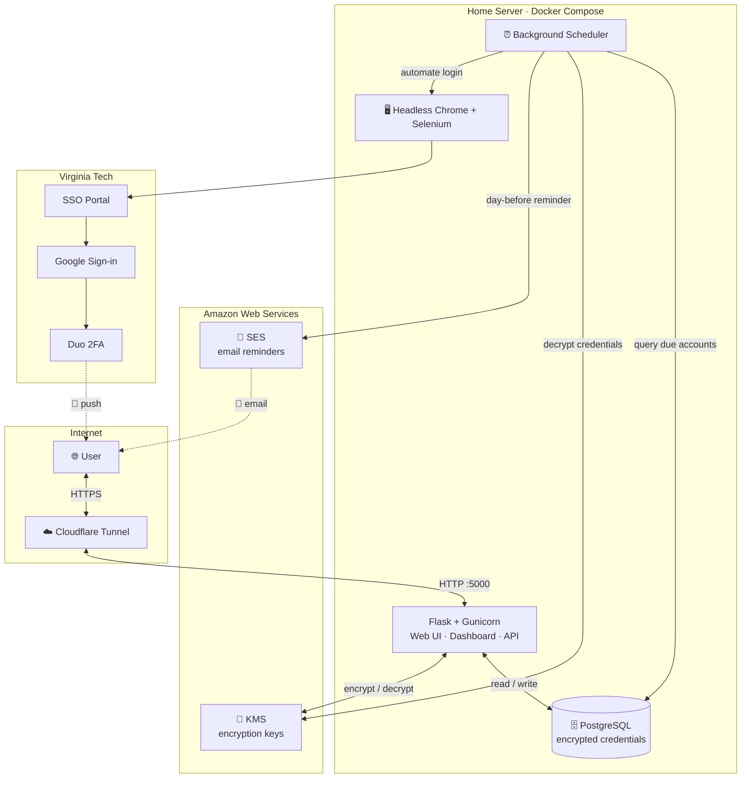

# Virginia Tech Email Saver


Keep your Virginia Tech Gmail account active with automated logins. This Flask-based web app securely stores your credentials, automates the entire VT SSO + Duo 2FA login flow, and lets you control how often it runs.

## Architecture



<details>
<summary><strong>System architecture (click to expand)</strong></summary>



</details>

## Security

Your credentials are **never stored in plaintext**. Here's what happens when you submit them:

1. **Encryption at rest** — Your password is encrypted using [AWS KMS](https://aws.amazon.com/kms/) (Key Management Service) before it ever touches the database. The encryption key lives in AWS, not on the server.
2. **Session-based authentication** — The dashboard is protected by server-side sessions. There are no user-facing URLs that leak account information.
3. **CSRF protection** — Every form submission and AJAX request is guarded by Flask-WTF CSRF tokens, preventing cross-site request forgery.
4. **Endpoint lockdown** — All sensitive endpoints (dashboard, scheduler, cadence updates, progress polling) require an authenticated session. Unauthenticated requests are rejected or redirected.
5. **Secure cookies** — Session cookies are HTTP-only and SameSite-restricted. In production, they require HTTPS.
6. **No credential logging** — Passwords are never written to logs or console output. The app uses structured Python `logging` throughout.

The source code is fully open — you can audit every line.

## Features

- **Automated Gmail Logins** — Selenium drives a headless Chrome instance through VT's SSO portal, Google sign-in, and Duo 2FA prompts.
- **AWS KMS Encryption** — Credentials are encrypted with a KMS key before database storage and only decrypted at login time.
- **Configurable Login Cadence** — Set how often the app logs in on your behalf (1–90 days, defaults to 25) via a dashboard slider.
- **Background Scheduler** — A daemon thread checks daily for accounts due for a login and runs them automatically.
- **Login Reminders** — Optional email notification the day before each login so you're ready for the Duo push, plus a downloadable recurring `.ics` calendar event with built-in alarms (works with Apple Calendar, Google Calendar, and Outlook).
- **Session-Protected Dashboard** — View your last login, next scheduled login, scheduler status, and adjust settings.
- **CSRF Protection** — All POST endpoints are protected against cross-site request forgery via Flask-WTF.
- **Modern UI** — Glassmorphism card design, gradient background, Rubik font, Lottie animations for processing feedback, and responsive layout.
- **Production-Ready** — Gunicorn WSGI server, PostgreSQL database, Docker Compose orchestration, and Cloudflare Tunnel support for secure hosting.

## Tech Stack

| Layer | Technology |
|-------|-----------|
| Backend | Flask, Gunicorn, SQLAlchemy |
| Database | PostgreSQL (production), SQLite (development) |
| Encryption | AWS KMS via `aws-encryption-sdk` |
| Notifications | AWS SES (email), iCalendar (.ics) |
| Browser Automation | Selenium + headless Chrome |
| Frontend | HTML/CSS/JS, Bootstrap 5, Lottie animations |
| Infrastructure | Docker Compose, Cloudflare Tunnel |

## Development vs. Production

**Development** — SQLite, Flask dev server with debug mode and auto-reload.

**Production** — PostgreSQL, Gunicorn (single worker, 4 threads), Docker Compose, optional Cloudflare Tunnel for HTTPS exposure.

## Prerequisites

- Python 3.11+
- Docker + Docker Compose (for production)
- AWS account with a KMS key
- Google Chrome (installed automatically in Docker)

## Installation

1. **Clone the repository**:
   ```bash
   git clone https://github.com/tfeuerbach/virginiatech-email-saver.git
   cd virginiatech-email-saver
   ```

2. **Set up a virtual environment** (for local development):
   ```bash
   python3 -m venv .envs/vt_login
   source .envs/vt_login/bin/activate
   pip install -r requirements.txt
   ```

3. **Configure environment variables**:
   Copy `.env.example` to `.env` and fill in your values:
   ```
   AWS_ACCESS_KEY_ID=<your-access-key>
   AWS_SECRET_ACCESS_KEY=<your-secret-key>
   KMS_KEY_ID=arn:aws:kms:<region>:<account-id>:key/<key-id>
   SECRET_KEY=<random-secret-for-flask-sessions>
   FLASK_ENV=development
   ```

4. **Run locally**:
   ```bash
   flask --app web run
   ```

5. **Run in Docker** (production):
   ```bash
   docker compose up --build -d
   ```

   See [DEPLOY.md](DEPLOY.md) for full production deployment instructions including Cloudflare Tunnel setup.

## Usage

1. Open `http://localhost:5000` in your browser.
2. Enter your Virginia Tech email and password. Credentials are encrypted with AWS KMS and stored securely.
3. The app automates the login flow (SSO, Google sign-in, Duo push) and redirects you to your dashboard.
4. On the dashboard you can view login history, adjust your login cadence, download a recurring calendar event, and monitor the background scheduler.
5. When a login is coming up, you'll get an email reminder (if configured) and/or a calendar alert — just approve the Duo push on your phone.

## Email Notifications

Email reminders are optional. If configured, the app emails you the day before each scheduled login so you know to have your phone ready for the Duo push.

Add these to your `.env` (works with any SMTP provider — AWS SES, Gmail app passwords, SendGrid, etc.):

```
SMTP_HOST=email-smtp.us-east-1.amazonaws.com
SMTP_PORT=587
SMTP_USER=your-smtp-username
SMTP_PASSWORD=your-smtp-password
SMTP_FROM_EMAIL=noreply@yourdomain.com
SMTP_FROM_NAME=VT Email Saver
SMTP_USE_TLS=true
```

If `SMTP_HOST` is blank or missing, the app still works — it just skips email reminders. The dashboard will show the feature as "Off" until configured.

You can also download a recurring `.ics` calendar event from the dashboard that adds login reminders directly to your calendar app of choice.

## Testing

```bash
# Inside Docker (recommended — has all dependencies):
docker compose exec web python -m pytest tests/ -v

# Or locally with a virtual environment:
pytest
```

Covers unit tests (models, KMS encryption, authentication, CSRF, cadence validation) and integration tests (database operations).

## Contributing

Contributions are welcome. Feel free to fork the repository, submit pull requests, or suggest improvements.

## License

This project is licensed under the MIT License. See the `LICENSE` file for details.
